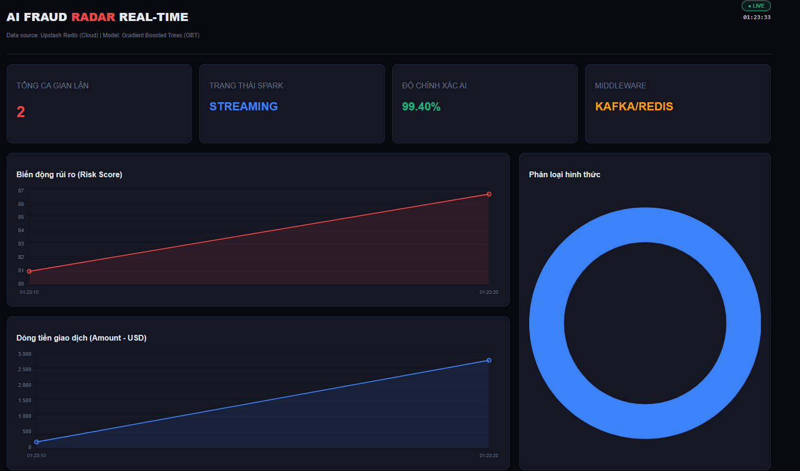
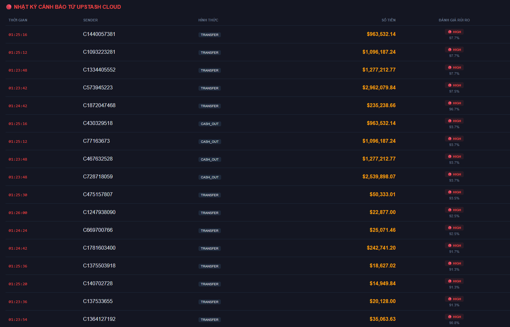
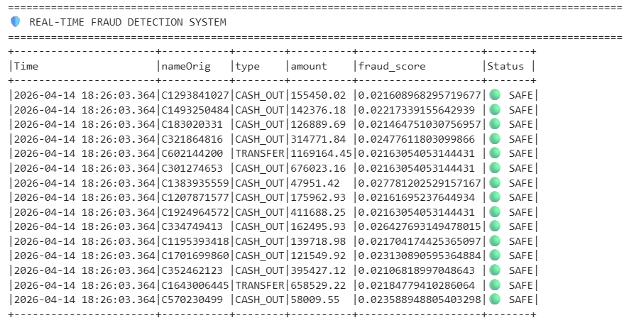
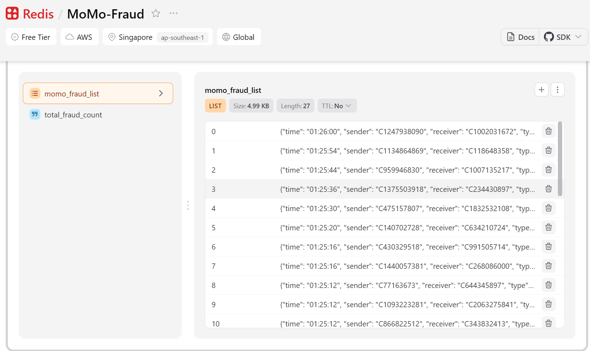

# 🛡️ AI FRAUD RADAR: Hệ thống Big Data Phát hiện Gian lận thời gian thực




**AI Fraud Radar** là đồ án môn học **Big Data**, tập trung vào việc xây dựng một hệ thống (Pipeline) xử lý dữ liệu toàn diện: từ quá trình huấn luyện mô hình học máy trên tập dữ liệu lịch sử cực lớn, đến việc xử lý luồng dữ liệu thời gian thực (Real-time Streaming) và hiển thị trực quan các cảnh báo gian lận trên nền tảng web hiện đại.

---
## 📋 Yêu cầu hệ thống (Prerequisites)
* Node.js (v18 trở lên)
* Tài khoản Upstash Redis (để lấy URL và Token)
* Tài khoản Kaggle (để chạy môi trường PySpark phân tán)
* Dataset: [PaySim Synthetic Dataset](https://www.kaggle.com/datasets/ealaxi/paysim1)

## 🏗️ Kiến trúc Hệ thống (Big Data Architecture)

Dự án mô phỏng một hệ thống bảo mật rủi ro ngân hàng / thanh toán hiện đại với 4 giai đoạn cốt lõi:

1. **Big Data Training (Kaggle Notebook / Spark Cluster)**
   * Sử dụng tập dữ liệu hành vi giao dịch tài chính **PaySim** với hơn **6.3 triệu mẫu dữ liệu** (Volume).
   * Huấn luyện mô hình **Gradient Boosted Trees (GBT)** trên môi trường tính toán phân tán (Apache Spark), thực hiện các kỹ thuật tiền xử lý phức tạp: *Imputer, OneHotEncoder, VectorAssembler và StringIndexer.*
   * **Đặc biệt:** Đã xử lý thành công hiện tượng rò rỉ dữ liệu (Data Leakage) có sẵn trong tập dữ liệu mô phỏng, đưa mô hình về sát với thực tế ngành tài chính. Mô hình đạt độ chính xác (Accuracy) **99.40%**, Recall **85.04%** và AUC Score **0.9959**.


2. **Distributed Streaming (Spark Structured Streaming)**
   * Chịu trách nhiệm tiêu thụ và xử lý dòng dữ liệu liên tục chảy vào hệ thống (Velocity) mô phỏng các log giao dịch đang diễn ra.
   * Áp dụng trực tiếp mô hình AI đã được huấn luyện trích xuất từ giai đoạn trước để đánh giá, phân loại xem một giao dịch là "An toàn" hay "Gian lận" ngay trong quá trình micro-batching.

   

3. **Middleware & Data Sink (Upstash Redis Cloud)**
   * Các phát hiện bất thường từ Spark cluster ngay lập tức được đẩy sang hệ thống **Upstash Redis Cloud** qua REST API (Ghi vào danh sách `momo_fraud_list` và cập nhật biến `total_fraud_count`).
   * Bước này sử dụng Redis làm hệ thống Cache tốc độ cao, đóng vai trò trạm trung chuyển (Decoupling) chuyên biệt nhằm giảm tải cho Big Data Engine và giúp Frontend dễ dàng lấy dữ liệu.

   

4. **Real-time Visualization (Next.js & Server-Sent Events)**
   * Dùng **Server-Sent Events (SSE)** độc quyền của giao thức HTTP kết hợp API Router từ **Next.js** để đẩy các cảnh báo mới nhất từ Redis lên Dashboard của người dùng theo chu kỳ (3 giây/lần), đảm bảo dữ liệu "sống" (Real-time).
   * Trực quan hoá tự động các chỉ số kỹ thuật: *Dòng tiền rủi ro, Phân loại hình thức giao dịch (CASH_OUT, TRANSFER, v.v.) và Cập nhật bảng chi tiết giao dịch liên tục mà không cần Re-load trang web.*

   

---

## 📊 Đặc trưng Big Data trong dự án (4V)

| Đặc trưng | Hiện thực hoá trong dự án của hệ thống |
| :--- | :--- |
| **Volume (Dữ liệu lớn)** | Khả năng huấn luyện trên tập dữ liệu tổng PaySim lên tới hàng gigabyte với hơn 6.3 triệu bản ghi giao dịch phức tạp. |
| **Velocity (Tốc độ)** | Triển khai Spark Streaming và Server-Sent Events quét Redis liên tục 3s/lần, mang lại xung nhịp phản hồi chỉ tính bằng mili-giây. |
| **Veracity (Độ tin chắc)** | Tối ưu độ chính xác thông qua các thông số của mô hình đánh giá AI (Random Forest) với Precision/Recall được kiểm chứng. |
| **Value (Giá trị)** | Biến dữ liệu thô và log streaming thành Dashboard cảnh báo sớm, cung cấp hệ thống ra quyết định theo thời gian thực để ngăn chặn chuyển tiền gian lận. |

---

## 🛠️ Trụ cột Công nghệ (Tech Stack)

Hệ thống kết hợp nhuần nhuyễn giữa kiến trúc phần mềm Data Engineering, Machine Learning và nền tảng Frontend Web thông qua:

* **Big Data Engine & AI Models:**
  * Apache Spark, PySpark Structured Streaming.
  * SparkML Lib (Xây dựng Model Random Forest Classifier và hệ Pipeline tiền xử lý phân tán).
* **Cloud Infrastructure (Middleware):**
  * **Upstash Redis**: Nền tảng Serverless Redis hỗ trợ tốc độ cao cho Data Sink.
  * Nền tảng luồng dữ liệu liên tục: Trạm phát giao dịch chuẩn JSON/CSV log.
* **Frontend Dashboard (Dự án trong kho lưu trữ này):**
  * **Next.js (Pages Router)** kết hợp **React 19**
  * **TypeScript**: Đảm bảo chặt chẽ kiểu dữ liệu cho toàn bộ code interface.
  * **Tailwind CSS v4**: Framework CSS thiết kế giao diện Dark-mode mang tính thẩm mỹ cao.
  * **Chart.js** & **react-chartjs-2**: Render linh động luồng dữ liệu thành hình ảnh biểu đồ thời gian thực.

---

## 🚀 Hướng dẫn khởi chạy Frontend (Local Development)

### Bước 0: Khởi chạy Data Pipeline & Streaming Engine (Kaggle)
1. Truy cập vào Kaggle Notebook chứa mã nguồn PySpark của dự án.
2. Đảm bảo đã import tập dữ liệu **PaySim**.
3. Run All các Cell để mô hình bắt đầu đọc Stream và đẩy dữ liệu lên Upstash Redis.
*(Lưu ý: Giữ tab Kaggle luôn mở để luồng dữ liệu không bị ngắt).*

### Bước 1. Cấu hình môi trường Web
Tạo một đoạn file mang tên `.env.local` tại thư mục gốc của project (cùng cấp với `package.json`) và nhập thông tin kết nối Upstash:
```env
UPSTASH_REDIS_REST_URL="https://your-database-url.upstash.io"
UPSTASH_REDIS_REST_TOKEN="your-access-token"
```

### Bước 2. Cài đặt các biến phụ thuộc (Dependencies)
```bash
# Sử dụng NPM để cài đặt tất cả các gói nền tảng front-end cần thiết
npm install
```

### Bước 3. Khởi động Server Dashboard
```bash
# Khởi cộng ứng dụng tại chế độ lập trình viên
npm run dev
```

💡 **Truy cập:** Mở trình duyệt web và điều hướng tới: `http://localhost:3000`

> Ngay sau khi mở liên kết, hệ thống Dashboard sẽ tự động thiết lập kết nối tới Redish Cloud qua luồng dữ liệu liên tục. Khi trạng thái chuyển sang **🟢 LIVE**, các cảnh báo rủi ro về "Dòng tiền" mới nhất từ Apache Spark tự động được hiển thị.
